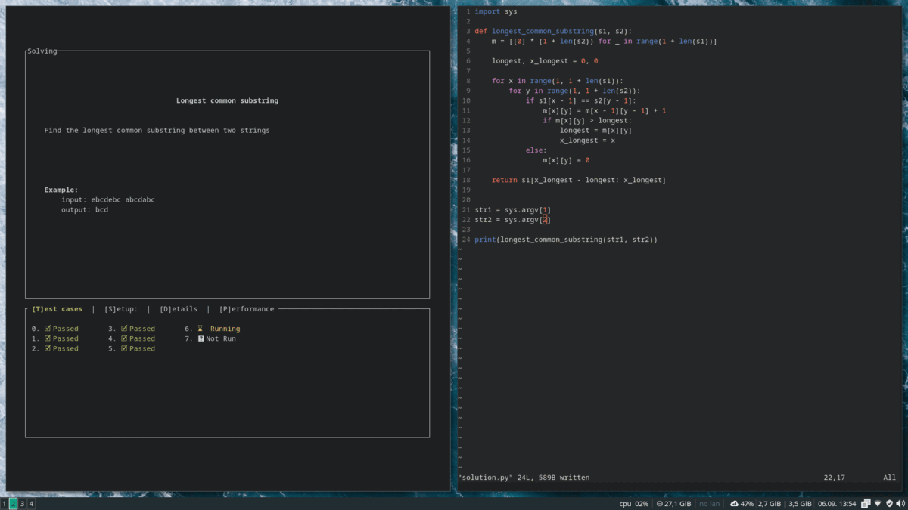

# algonds
Command line application for offline practice of competitive programming tasks.

## Demo


## How to run
Assuming Rust is installed:
```
  git clone https://github.com/MaciejWas/algonds
  cd algonds
  cargo run -- help
```

